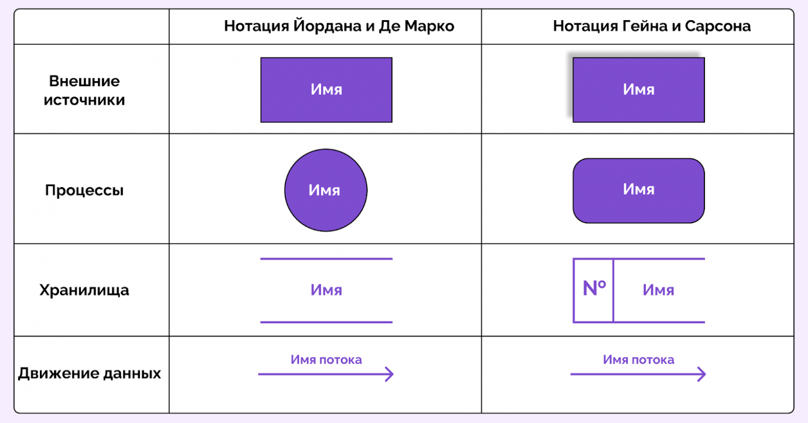

1. Выявите конфиденциальные данные, которые не учтены во внутренних системах.

    1. Создайте диаграммы потоков данных (Data Flow Diagrams). Для каждого процесса создайте отдельную диаграмму.

        ПРОЦЕССЫ:

        1. Регистрация пациента и заключение клиентских контрактов
        2. Запись пациента на приём
        3. Приём пациента у специалиста
        4. Забор анализов пациента
        5. Обработка лабораторных анализов
        6. Приём и учёт платежей пациентов
        7. Процессинг платежей
        8. Бухгалтерия 
        9. Учёт кадров, выплата зарплат и налогов
        10. Закупка и учёт  учёт ТМЦ ти оборудования для медицинских кабинетов
        11. Построение финансовых отчётов результатам работы


    2. Отобразите на них, как данные перемещаются по системам компании и какие операции над ними совершают.

---
### Нотации

```
Символы обозначают четыре компонента диаграмм потоков данных:

1. Внешняя сущность
    Внешняя сущность — это система, которая отправляет или получает данные и взаимодействует с системой, для которой строится диаграмма. Это источники и получатели информации, поступающей в систему или исходящей из нее. Это может быть внешняя организация или физическое лицо, компьютерная система или бизнес-система. Их также называют терминаторами, источниками и приемниками или акторами. Обычно они изображаются на краях диаграммы.

2. Процесс
    Процессы изменяют данные и создают выходные данные. Они могут выполнять вычисления, сортировать данные в соответствии с логикой или направлять поток данных в соответствии с бизнес-правилами. Для описания процесса используется короткая метка (например, «Отправить платеж»).

3. Хранилище данных
    Хранилища данных — это файлы или репозитории, в которых хранится информация для последующего использования (например,Например, таблица в базе данных или форма подписки). Каждое хранилище данных получает простую метку (например, «Заказы»).

4. Поток данных
    Поток данных описывает маршрут, по которому данные перемещаются между внешними объектами, процессами и хранилищами данных. Он отображает интерфейс между другими компонентами и обозначается стрелками, которые обычно снабжаются кратким названием данных (например, «Платежные реквизиты»).

Правила при работе с диаграммами потоков данных:

 - У каждого процесса должен быть хотя бы один вход и один выход.

 - У каждого хранилища данных должен быть хотя бы один входящий и один исходящий поток данных.

 - Данные, хранящиеся в системе, должны проходить через какой-либо процесс.

 - Все процессы на диаграмме потоков данных ведут к другому процессу или хранилищу данных.
```


```
Как построить DFD-диаграмму: пошаговая инструкция
Построение DFD — это итеративный процесс. Редко получается нарисовать идеальную схему с первого раза. Вот практический алгоритм, который работает.

Шаг 1. Определите границы системы
Четко обозначьте, что входит в анализируемую систему, а что является внешней сущностью. Составьте список внешних источников и получателей данных.

Вопросы для проверки:

Кто или что отправляет данные в систему?
Кто или что получает данные из системы?
Где заканчивается ваша зона ответственности?
Шаг 2. Нарисуйте контекстную диаграмму
Нарисуйте схему верхнего уровня: в центре — ваша система целиком, вокруг — внешние участники, между ними — стрелки с данными, которые идут туда и обратно. Такая схема помогает всей команде синхронизировать видение системы и договориться о границах анализа.

Шаг 3. Декомпозируйте систему на ключевые процессы
Выделите 5-7 💡 ключевых процессов: для небольших систем их может быть 3-5, для крупных — до 9). Не стоит сразу углубляться в детали, так как для начала должна быть оценка общей картины. 

Шаг 4. Определите хранилища данных
Где система сохраняет информацию? Базы данных, файлы, кэш, очереди сообщений. Покажите, какие процессы читают и записывают данные в каждое хранилище.

Шаг 5. Покажите потоки данных
Соедините процессы стрелками, подпишите, какие данные передаются. Важно: данные должны иметь конкретные названия.

💡
Плохо: стрелка с подписью «данные». Хорошо: «данные заказа (номер, состав, сумма, адрес доставки)».
Шаг 6. Детализируйте при необходимости
Выберите сложные процессы и разбейте их на подпроцессы следующего уровня. 

Типичные ошибки при построении DFD
Вот самые распространенные проблемы и как их избежать.

Слишком детальные диаграммы
Попытка показать все сразу делает схему нечитаемой. Используйте уровни детализации. Если на одной диаграмме больше 10 элементов — разбивайте.

Как исправить: группируйте процессы по функциональным блокам. Детали прячьте на следующем уровне.

Смешивание данных
DFD показывает только потоки данных, не последовательность действий во времени. Для временных зависимостей есть другие диаграммы (например, BPMN).

Неправильное использование хранилищ
Хранилище не может напрямую передавать данные в другое хранилище, только через процесс. Это логично: данные не телепортируются между базами сами по себе, их копирует или перемещает какой-то процесс.

💡
Правило: стрелка всегда идет либо ОТ процесса, либо К процессу.
Отсутствие балансировки между уровнями
Детализированная схема должна соответствовать главному процессу по всем информационным потокам. Представьте: если верхнеуровневый процесс принимает клиентскую информацию, то при детализации эта информация обязана фигурировать где-то внутри. 

Как проверить: возьмите все входящие и исходящие потоки родительского процесса и убедитесь, что они присутствуют на детальной схеме в том же объеме — ничего не потерялось и не появилось лишнего.
```